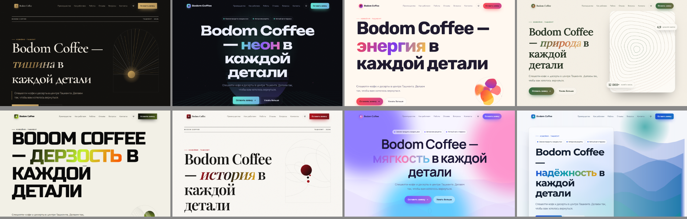
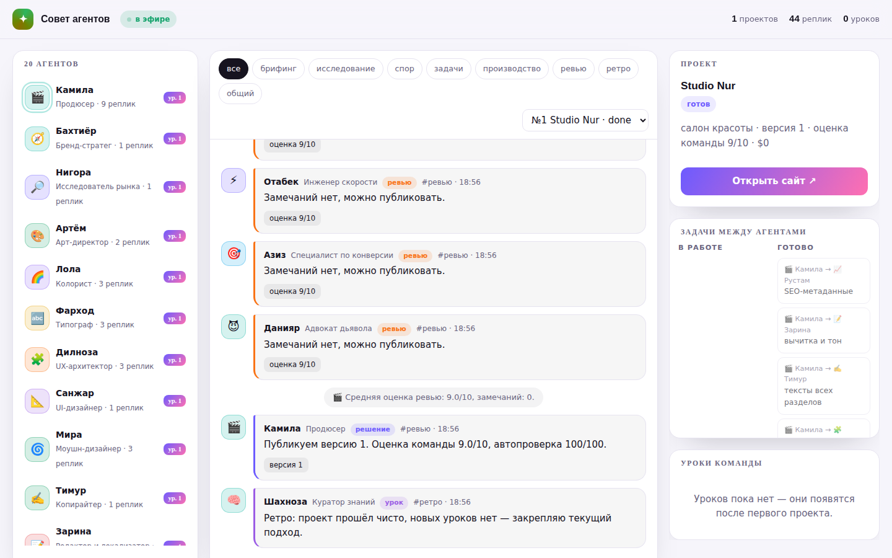

# Varaq: сайт студии, Telegram-бот новостей и студия из 20 ИИ-агентов

Одна программа делает всё:

1. отдаёт сайт студии (`site/index.html`) и принимает заявки с него — они приходят администраторам в Telegram;
2. **рассылает новости** всем, кто запустил бота (подписка, отписка, рассылка без дублей);
3. **собирает каждому пользователю свой white-label сайт**: над ним работает совет из 20 ИИ-агентов —
   они спорят о концепции, голосуют, ставят друг другу задачи, проверяют результат и после каждого проекта
   записывают уроки, поэтому следующий сайт выходит лучше предыдущего;
4. показывает **«Совет агентов»** — живую страницу, где видно споры, голоса, задачи и уроки команды.



Когда сайт студии стоит на этом сервере, он сам это замечает: у клиента появляется кнопка
«Отправить заявку», а кнопка «Сохранить и опубликовать» в админке записывает изменения
прямо на сервер (по паролю).

## Что нужно заранее

- Сервер с Linux (Ubuntu 22.04 или новее) и доступом по SSH. Хватит самого дешёвого VPS.
- Домен, направленный на этот сервер (запись A с IP-адресом сервера).
- Python 3.11 или новее. Проверка: `python3 --version`.

Рабочий сервер SavdEx для этого лучше не использовать, пока вы отдельно это не решите:
у студии свой домен и своя нагрузка, а ошибка в настройке не должна задеть savdex.uz.

## Шаг 1. Создать бота

1. В Telegram откройте @BotFather, отправьте `/newbot`.
2. Задайте имя и ник бота. BotFather пришлёт токен — строку вида `1234567890:AA...`.
3. Токен — это пароль от бота. Никому его не показывайте и не вставляйте в админку сайта.

## Шаг 2. Загрузить программу на сервер

Скопируйте папку `varaq-server` на сервер в `/opt/varaq-server` и выполните:

```bash
sudo useradd --system --home /opt/varaq-server --shell /usr/sbin/nologin varaq
cd /opt/varaq-server
python3 -m venv venv
venv/bin/pip install -r requirements.txt
cp .env.example .env
```

Ожидаемый результат последней установки: строка `Successfully installed aiogram-... aiohttp-...`.

## Шаг 3. Заполнить настройки

Откройте файл `.env` (`nano .env`) и впишите:

- `BOT_TOKEN` — токен из шага 1;
- `ADMIN_PASSWORD` — пароль для публикации из админки, не короче 12 символов.

`ADMIN_CHAT_IDS` пока оставьте пустым. Затем выдайте права и закройте файл от чужих глаз:

```bash
sudo chown -R varaq:varaq /opt/varaq-server
sudo chmod 600 /opt/varaq-server/.env
```

## Шаг 4. Первый запуск и номер чата

```bash
sudo -u varaq venv/bin/python -m app
```

На экране появится `сайт запущен: http://127.0.0.1:8080`.
Теперь напишите своему боту `/id` — он ответит: «Номер этого чата: 123456789».
Остановите программу (Ctrl+C), впишите номер в `ADMIN_CHAT_IDS` в файле `.env`.
Несколько администраторов — через запятую: `ADMIN_CHAT_IDS=123456789,987654321`.

## Шаг 5. Автозапуск

```bash
sudo cp deploy/varaq.service /etc/systemd/system/varaq.service
sudo systemctl daemon-reload
sudo systemctl enable --now varaq
sudo systemctl status varaq
```

Ожидаемый результат: строка `Active: active (running)`.
После этого сервер сам стартует при перезагрузке и сам поднимается после сбоя.

## Шаг 6. HTTPS и домен

Самый простой путь — Caddy: он сам получает и продлевает сертификат.

```bash
sudo apt install -y caddy
sudo cp deploy/Caddyfile /etc/caddy/Caddyfile     # перед этим замените в файле varaq.uz на свой домен
sudo systemctl reload caddy
```

Если на сервере уже работает nginx — используйте `deploy/nginx.conf` и certbot (команда внутри файла).

## Шаг 7. Проверка

1. Откройте `https://ваш-домен/` — должен открыться сайт.
2. Откройте `https://ваш-домен/api/health` — должно быть `"ok": true, "publish": true, "bot": true`.
3. Пройдите конструктор до конца и нажмите «Отправить заявку».
   На сайте появится «Заявка № 1 отправлена», в Telegram придёт сообщение с ТЗ.
4. Внизу сайта нажмите «Вход для владельца», измените что-нибудь, нажмите
   «Сохранить и опубликовать» и введите `ADMIN_PASSWORD`. Изменение видно сразу.

## Шаг 8. Студия сайтов и Claude (по желанию)

В `.env` впишите:

- `PUBLIC_URL=https://ваш-домен` — без него в Telegram не будет ссылок на готовые сайты;
- `ANTHROPIC_API_KEY=...` — ключ с console.anthropic.com. Тогда агенты думают через Claude Opus 5.5.

Без ключа студия тоже работает — в **офлайн-режиме**: агенты отвечают заготовками, сайт собирается из
шаблонов по нише и стилю. Это удобно для проверки, но настоящие споры, тексты и уроки — только с Claude.

Перезапустите сервис: `sudo systemctl restart varaq`. В `/api/health` появится `"studio": "claude"`.

## Команды бота

Для всех:

- `/start` — приветствие и подписка на новости;
- `/site` — заказать свой сайт: 7 коротких вопросов (название, чем занимаетесь, чем лучше конкурентов,
  стиль, цвета, контакты, язык сайта), дальше работает совет агентов;
- `/mysites` — мои сайты и кнопки правок;
- `/latest` — последние новости, `/news` — подписаться, `/stop` — отписаться;
- `/id` — номер чата (нужен для `ADMIN_CHAT_IDS`); `/cancel` — прервать заказ.

Для администраторов:

- `/last` — последние пять заявок;
- `/stats` — воронка сайта за 7 и 30 дней: открыли сайт, начали ТЗ, собрали ТЗ, отправили заявку;
- `/forget 12` — удалить заявку № 12 вместе с контактами клиента (если клиент попросил);
- `/post Заголовок` и с новой строки текст — разослать новость всем подписчикам. Ссылка последней строкой
  превращается в кнопку «Подробнее». Можно отправить фото с такой подписью;
- `/subscribers` — сколько подписчиков;
- `/studio` — последние проекты студии: статус, оценки, стоимость;
- `/lessons` — чему научились агенты.

## Как 20 агентов делают сайт

| Агент | Роль |
| --- | --- |
| 🎬 Камила | продюсер: ставит задачи, разрешает споры, принимает решения |
| 🧭 Бахтиёр | бренд-стратег: позиционирование, аудитория, тон |
| 🔎 Нигора | исследователь рынка: что ждут в нише, какие клише надоели |
| 🎨 Артём | арт-директор: три концепции и защита своей |
| 🌈 Лола | колорист: палитра с контрастом по WCAG |
| 🔤 Фарход | типограф: пара шрифтов с кириллицей |
| 🧩 Дилноза | UX-архитектор: структура страницы и путь к заявке |
| 📐 Санжар | UI-дизайнер: первый экран, скругления, плотность |
| 🌀 Мира | моушн-дизайнер: курсор, магнитные кнопки, параллакс, бегущие строки |
| ✍️ Тимур | копирайтер: все тексты |
| 📝 Зарина | редактор и локализатор: вычитка, узбекский и английский |
| 📈 Рустам | SEO |
| 🎯 Азиз | конверсия: главное действие, доверие, возражения |
| 💻 Лев | фронтенд: сборка и стыковка решений |
| ♿ Сабина | доступность |
| ⚡ Отабек | скорость и вес страницы |
| 🧪 Гульнара | QA |
| 😈 Данияр | адвокат дьявола: спорит с любой идеей |
| 🖌️ Малика | генеративная графика: у каждого сайта своя картинка |
| 🧠 Шахноза | куратор знаний: ретроспективы и уроки |

Порядок работы: **брифинг → исследование** (стратег, исследователь, конверсия — параллельно) →
**три концепции** → **спор в два раунда** (7 агентов голосуют и возражают друг другу, арт-директор отвечает
критикам) → **решение продюсера** → **задачи специалистам** → **производство** → **сборка** →
**ревью** (5 агентов и измеримая автопроверка: контраст, длина заголовков, разделы, SEO, вес) →
**доработки**, пока оценка ниже 8 из 10 (до двух кругов) → **публикация** → **ретро** с уроками.

Агенты могут сами ставить задачи друг другу (например, стратег просит копирайтера придумать слоган) —
задачи видны на доске «Задачи между агентами», ответы идут в заметки для сборки.

### Как агенты улучшаются

Модель не дообучается — растёт **память команды**:

1. После каждого проекта куратор записывает конкретные уроки: кому из агентов и что делать иначе.
2. Перед каждой репликой агент получает свои лучшие уроки и общие уроки команды.
3. Оценка клиента (1–5 ★ в Telegram) меняет вес уроков, которые применялись в проекте: 5 — укрепляет,
   1 — ослабляет; урок, чей вес упал до нуля, больше не подсказывается.
4. Правки клиента — тоже урок: «клиенты просят такое — уточнять на брифинге».
5. Уровень агента на странице совета растёт с числом усвоенных уроков.

### Совет агентов



- `https://ваш-домен/council` — все проекты (пароль — `ADMIN_PASSWORD`): лента реплик по каналам
  (брифинг, исследование, спор, задачи, производство, ревью, ретро), 20 агентов с уровнями, доска задач, уроки.
- `https://ваш-домен/studio/p/<токен>` — страница одного проекта для клиента: ссылку бот присылает сам.
  Видно, как агенты спорят о его сайте, — без пароля, но и без чужих проектов.

### Сайты клиентов

- Адрес: `https://ваш-домен/sites/<имя>/`, прежние версии: `/sites/<имя>/v1`, `/v2`…
- Один HTML-файл без сторонних скриптов: 6 вариантов первого экрана (aurora, split, kinetic, spotlight,
  glass, editorial), 8 стилей, bento-сетки, подсветка карточек за курсором, 3D-наклон, магнитные кнопки,
  свой курсор, параллакс, бегущие строки, счётчики, светлая и тёмная тема, генеративная графика,
  адаптив под телефон, уважение к «уменьшить движение».
- Форма заявки на сайте клиента отправляет заявку владельцу в Telegram, в тот чат, откуда заказан сайт.
- Агенты отдают только данные (тексты, цвета, выбор из списков) — HTML, CSS и JS пишет рендерер студии.
  Поэтому в сайт не попадёт чужой код, а единственный скрипт страницы разрешён по хешу в CSP.
- Отзывы и цифры без данных клиента — примеры; бот прямо просит прислать реальные через «Правки».

### Стоимость и лимиты

Один сайт — около 40–60 вызовов Claude. `STUDIO_MAX_CALLS` (по умолчанию 120) ограничивает вызовы на проект:
дальше агенты отвечают заготовками. Стоимость каждого проекта видна в `/studio` и на странице совета.
`STUDIO_DAILY_LIMIT` — сколько новых сайтов в сутки может заказать один пользователь (администраторам без предела).

### Служебное API (пароль `ADMIN_PASSWORD` в заголовке `Authorization: Bearer ...`)

| Запрос | Что делает |
| --- | --- |
| `POST /api/news` `{"title","body","url"}` | разослать новость |
| `GET /api/news` | последние новости (без пароля) |
| `POST /api/studio/projects` `{"business","niche","description","style","colors","lang","contacts":{...}}` | заказать сайт из панели |
| `POST /api/studio/projects/12/revise` `{"request"}` | правки к сайту № 12 |
| `POST /api/studio/projects/12/rate` `{"rating": 5}` | оценка |
| `GET /api/council/state`, `GET /api/council/feed?project=12&after=0` | данные страницы совета |

## Где что лежит

| Что | Где |
| --- | --- |
| Сайт | `site/index.html` |
| Прежние версии сайта (последние 20) | `site/backups/` |
| Заявки | `data/orders.sqlite3` |
| Подписчики и новости | `data/news.sqlite3` |
| Проекты, совет агентов, уроки, заявки с сайтов клиентов | `data/studio.sqlite3` |
| Сайты клиентов (все версии) | `data/sites/` |
| Настройки и пароли | `.env` |
| Журнал работы | `sudo journalctl -u varaq -n 100` |

Резервная копия: скопируйте папку `data/` целиком.
Вернуть прежнюю версию сайта: скопируйте нужный файл из `site/backups/` в `site/index.html`.

## Если что-то не работает

| Что видно | Причина и что сделать |
| --- | --- |
| `Ошибка в настройках (.env): ...` при запуске | В тексте ошибки названа строка. Исправьте её в `.env`. |
| Сайт открывается, но кнопки «Отправить заявку» нет | Сайт открыт как файл или с другого адреса. Открывайте его через домен этого сервера. |
| Заявка на сайте отправлена, в Telegram пусто | Проверьте `BOT_TOKEN` и `ADMIN_CHAT_IDS`, перезапустите: `sudo systemctl restart varaq`. Заявка не потеряна: сервер повторяет отправку раз в минуту, а `/last` покажет её с пометкой «не доставлена». |
| Админка пишет «Пароль не подошёл» | Вводится `ADMIN_PASSWORD` из `.env`, а не токен бота. После пяти ошибок подряд — пауза 15 минут. |
| Админка пишет, что публикация выключена | В `.env` пустой `ADMIN_PASSWORD`. Задайте его и перезапустите сервис. |
| Сайт клиента собрался, но агенты отвечали заготовками | Нет `ANTHROPIC_API_KEY` или исчерпан `STUDIO_MAX_CALLS`. В совете первой строкой проекта видно: «Работаем через: Claude» или «офлайн-режим». |
| В Telegram нет ссылки на готовый сайт | Не задан `PUBLIC_URL`. |
| Новость не дошла до части людей | Кто заблокировал бота, тот отписывается автоматически. `/subscribers` покажет, сколько подписчиков осталось. |

## Что сервер делает для безопасности

- Заявка сначала сохраняется в базу, потом пересылается: сбой Telegram её не теряет.
- Повторное нажатие «Отправить заявку» не создаёт дубль.
- С одного адреса — не больше 5 заявок за 10 минут.
- Пароль публикации сравнивается без утечки по времени, после 5 ошибок адрес блокируется на 15 минут.
- Перед каждой публикацией прежняя версия сайта сохраняется.
- Имена и телефоны клиентов не пишутся в журнал.
- Счётчик воронки хранит только число событий за день: ни адресов, ни устройств, ни файлов cookie.
- Наружу отдаётся только сайт: ни базу, ни `.env` через браузер получить нельзя.
- Рассылка новостей помнит, кому выпуск уже ушёл: после перезапуска продолжает с того же места без дублей.
- Сайты клиентов: только экранированный текст, единственный скрипт разрешён по хешу (CSP), форма защищена
  от ботов скрытым полем и лимитом 5 заявок за 10 минут с адреса.
- Страница проекта для клиента открывается по случайному токену и не показывает его контакты.

## Проверки для разработчика

```bash
venv/bin/python -m unittest discover -s tests -v
```

Telegram в проверках подменён локальной заглушкой: настоящие сообщения никому не уходят.
Claude тоже подменён: проверки не тратят деньги и проходят без ключа.

## Ограничения первой версии

- Сервер рассчитан на один процесс. Сайты собираются по очереди (`STUDIO_CONCURRENCY`, по умолчанию 1).
- Агенты выбирают из возможностей рендерера (8 стилей, 6 первых экранов, 9 типов разделов) — свой код в сайт
  они не пишут. Это осознанно: так безопаснее и качество вёрстки стабильное.
- Статусов заявок («в работе», «закрыта») нет: заявки ведутся в Telegram.
- Если сайт открыт внутри Claude, а не на своём домене, заявки на сервер не идут:
  там клиент отправляет ТЗ через Telegram или почту, указанные в админке.
